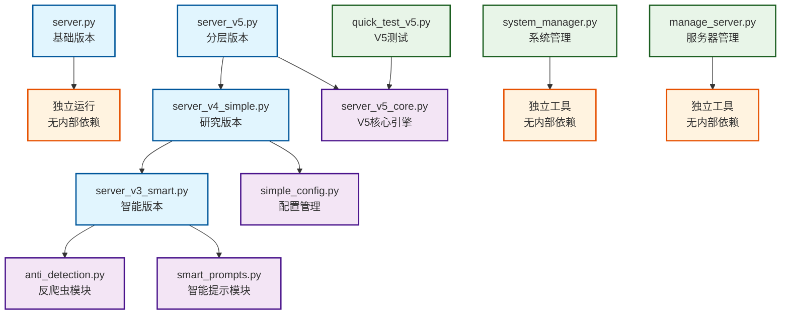
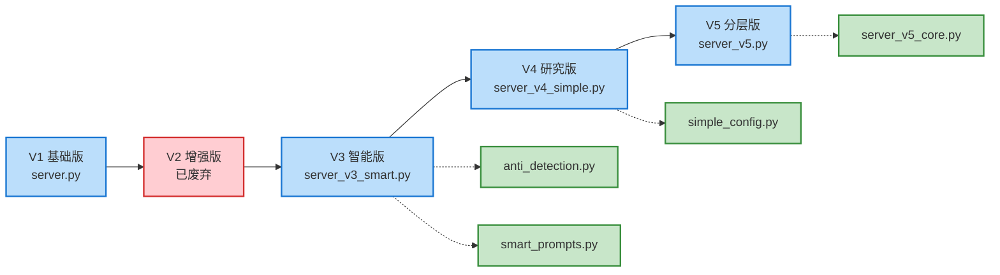
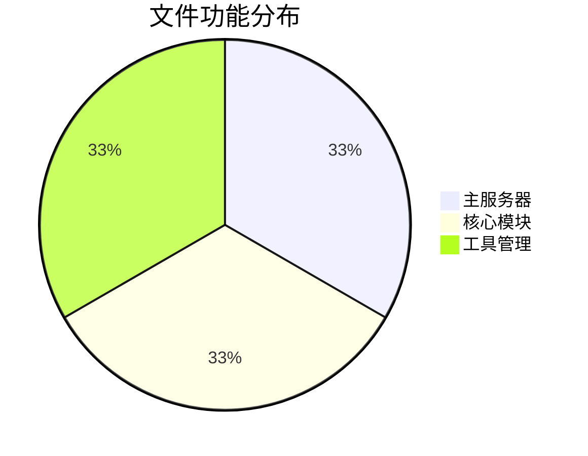
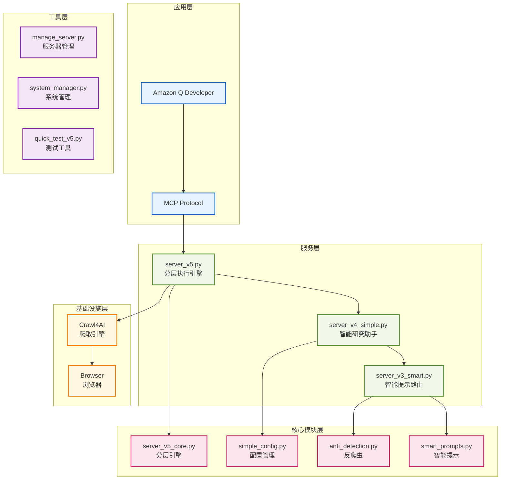

# Context Scraper MCP Server - 依存关系可视化图

## 🎯 核心依存关系图



## 🔄 版本演进流程图



## 📊 模块功能分布图



## 🏗️ 架构层次图



## 🔍 详细依赖分析

### 直接依赖关系

| 文件 | 直接依赖 | 依赖类型 |
|------|----------|----------|
| `server_v5.py` | `server_v4_simple.py` | 完全导入 (`import *`) |
| `server_v5.py` | `server_v5_core.py` | 选择导入 |
| `server_v4_simple.py` | `server_v3_smart.py` | 完全导入 (`import *`) |
| `server_v4_simple.py` | `simple_config.py` | 选择导入 |
| `server_v3_smart.py` | `anti_detection.py` | 选择导入 |
| `server_v3_smart.py` | `smart_prompts.py` | 选择导入 |
| `quick_test_v5.py` | `server_v5_core.py` | 测试导入 |

### 间接依赖关系

```
server_v5.py
├── server_v4_simple.py
│   ├── server_v3_smart.py
│   │   ├── anti_detection.py
│   │   └── smart_prompts.py
│   └── simple_config.py
└── server_v5_core.py
```

## 🚨 潜在问题和建议

### 1. 循环依赖风险
- ✅ **当前状态**: 无循环依赖
- 🔍 **监控点**: V5 核心模块保持独立

### 2. 导入链过长
- ⚠️ **问题**: V5 → V4 → V3 → 模块，导入链较长
- 💡 **建议**: 考虑直接导入核心模块

### 3. 配置文件不一致
- ⚠️ **问题**: README 中使用 `server.py`，但最新功能在 `server_v5.py`
- 💡 **建议**: 更新配置指向 V5

### 4. 测试覆盖
- ✅ **优点**: V5 有专门测试文件
- 💡 **建议**: 增加 V3/V4 的测试覆盖

## 🎯 优化建议

### 短期优化
1. **更新主入口**: 将 `server.py` 重命名为 `server_v1.py`，`server_v5.py` 重命名为 `server.py`
2. **配置更新**: 更新 README 和配置文件指向最新版本
3. **文档同步**: 确保文档与实际使用的版本一致

### 长期优化
1. **模块重构**: 考虑将核心功能提取到独立包
2. **版本管理**: 建立更清晰的版本管��策略
3. **测试完善**: 建立完整的测试体系

## 📋 维护检查清单

- [ ] 检查所有 import 语句是否正确
- [ ] 验证版本间的兼容性
- [ ] 确保配置文件指向正确版本
- [ ] 测试所有依赖模块的功能
- [ ] 检查是否有未使用的文件
- [ ] 验证工具文件的独立性
